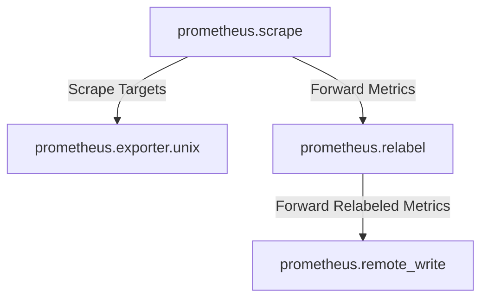
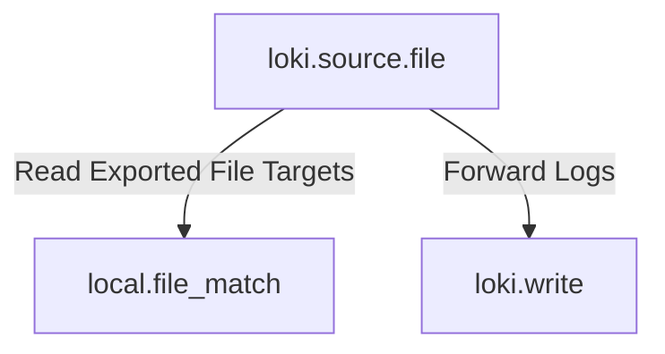
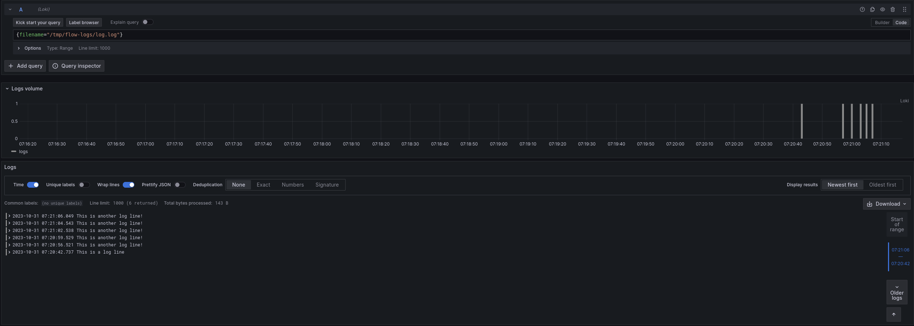
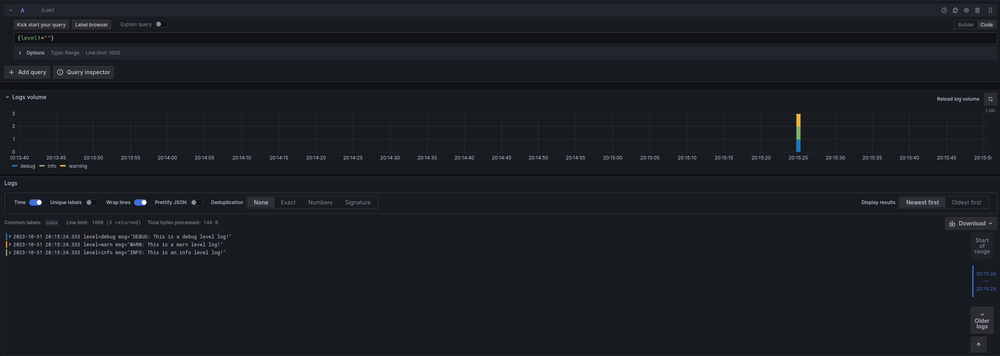

# Logs and Relabeling

_This section assumes you have completed the [First Component and Standard Library](../00-first-component-and-standard-library) section, or are at least familiar with the concepts of components, attributes, and expressions and how to use them. You will cover some basic metric relabeling followed by how to send logs to Loki._

## Relabeling Metrics

### Recommended Reading

- Optional: [prometheus.relabel](https://grafana.com/docs/agent/latest/flow/reference/components/prometheus.relabel/)

Before we move on to logs, let's take a look at how we can use the `prometheus.relabel` component to relabel metrics. The `prometheus.relabel` component allows you to perform Prometheus relabeling on metrics and is similar to the `relabel_configs` section of a Prometheus scrape config.

Let's add a `prometheus.relabel` component to a basic pipeline and see how to add labels.

```river
prometheus.exporter.unix "localhost" { }

prometheus.scrape "default" {
    scrape_interval = "10s"

    targets    = prometheus.exporter.unix.localhost.targets
    forward_to = [
        prometheus.relabel.example.receiver,
    ]
}

prometheus.relabel "example" {
    forward_to = [
        prometheus.remote_write.local_prom.receiver,
    ]

    rule {
        action       = "replace"
        target_label = "os"
        replacement  = constants.os
    }
}

prometheus.remote_write "local_prom" {
    endpoint {
        url = "http://localhost:9090/api/v1/write"
    }
}
```

We have now created the following pipeline:



This pipeline has a `prometheus.relabel` component that has a single rule. This rule has the `replace` action, which will replace the value of the `os` label with a special value: `constants.os`. This value is a special constant that will be replaced with the os of the host the Agent is running on. You can see the other available constants in the [constants](https://grafana.com/docs/agent/latest/flow/reference/stdlib/constants/) documentation page. In this example we have one rule block, but you can have as many as you want. Each rule block will be applied in order.

If you run the Agent and navigate to [localhost:3000/explore](http://localhost:3000/explore), you should be able to see the `os` label on the metrics. Try querying for `node_context_switches_total` and look at the labels!

Relabeling uses the same rules as Prometheus. You can always refer to the [prometheus.relabel documentation](https://grafana.com/docs/agent/latest/flow/reference/components/prometheus.relabel/#rule-block) for a full list of available options.

**Pro tip**: _You can have multiple components forward to one `prometheus.relabel` component. This allows you to apply the same relabeling rules to multiple pipelines._

**Pro tip 2**: _There is a common gotcha when it comes to trying to keep metrics that start with `__` (double underscore). These labels are considered internal and will be dropped before relabeling rules from a `prometheus.relabel` component are applied. If you would like to keep these kinds of labels, use a [discovery.relabel](https://grafana.com/docs/agent/latest/flow/reference/components/discovery.relabel/) component. We will cover doing this in an example later._

## Sending Logs to Loki

### Recommended Reading

- Optional: [local.file_match](https://grafana.com/docs/agent/latest/flow/reference/components/local.file_match/)
- Optional: [loki.source.file](https://grafana.com/docs/agent/latest/flow/reference/components/loki.source.file/)
- Optional: [loki.write](https://grafana.com/docs/agent/latest/flow/reference/components/loki.write/)

Now that you're comfortable creating components and chaining them together, let's collect some logs and send them to Loki. We will use the `local.file_match` component to perform file discovery, the `loki.source.file` to collect the logs, and the `loki.write` component to send the logs to Loki.

Before we do this, we need to make sure we have a log file to collect. We will use the `echo` command to create a file with some logs in it.

```bash
mkdir -p /tmp/flow-logs
echo "This is a log line" > /tmp/flow-logs/log.log
```

Now that we have a log file, let's create a pipeline to collect it.

```river
local.file_match "tmplogs" {
    path_targets = [{"__path__" = "/tmp/flow-logs/*.log"}]
}

loki.source.file "local_files" {
    targets    = local.file_match.tmplogs.targets
    forward_to = [loki.write.local_loki.receiver]
}

loki.write "local_loki" {
    endpoint {
        url = "http://localhost:3100/loki/api/v1/push"
    }
}
```

The rough flow of this pipeline is:



If you navigate to [localhost:3000/explore](http://localhost:3000/explore) and switch the Datasource to `Loki`, you should be able to query for `{filename="/tmp/flow-logs/log.log"}` and see the log line we created earlier! Try running:

```bash
echo "This is another log line!" >> /tmp/flow-logs/log.log
```

to add some more logs to the file. If you re-execute the query, you should see the new log lines.



If you are curious how the Agent keeps track of where in a log file it is, you can take a look at `data-agent/loki.source.file.local_files/positions.yml`. If you delete this file, the Agent will start reading from the beginning of the file again, which is why it is desirable to keep the Agent's data directory in a persistent location.

## Exercise for the Reader

### Recommended Reading

- [loki.relabel](https://grafana.com/docs/agent/latest/flow/reference/components/loki.relabel/)
- [loki.process](https://grafana.com/docs/agent/latest/flow/reference/components/loki.process/)

### Add a Label to Logs

This exercise will have two parts, building on the previous example. Let's start by adding an `os` label (just like the Prometheus example) to all of the logs we are collecting.

Modify the following snippet to add label `os` with the value of the `os` constant.

```river
local.file_match "tmplogs" {
    path_targets = [{"__path__" = "/tmp/flow-logs/*.log"}]
}

loki.source.file "local_files" {
    targets    = local.file_match.tmplogs.targets
    forward_to = [loki.write.local_loki.receiver]
}

loki.write "local_loki" {
    endpoint {
        url = "http://localhost:3100/loki/api/v1/push"
    }
}
```

_**Hint**: The [loki.relabel](https://grafana.com/docs/agent/latest/flow/reference/components/loki.relabel) component can be used to relabel **or** add labels._

Once you have your completed config, run the Agent and execute the following:

```bash
echo 'level=info msg="INFO: This is an info level log!"' >> /tmp/flow-logs/log.log
echo 'level=warn msg="WARN: This is a warn level log!"' >> /tmp/flow-logs/log.log
echo 'level=debug msg="DEBUG: This is a debug level log!"' >> /tmp/flow-logs/log.log
```

Navigate to [localhost:3000/explore](http://localhost:3000/explore) and switch the Datasource to `Loki`. Try querying for `{filename="/tmp/flow-logs/log.log"}` and see if you can find the new label!

Now that we have added new labels, we can also filter on them. Try querying for `{os!=""}`. You should only see the lines you added in the previous step.

### Extract and add a Label from Logs

_**NOTE**: This exercise is more challenging than the previous one. If you are having trouble, feel free to skip it and move to the next section, which will cover some of the concepts used here. You can always come back to this exercise later!_

This exercise will build on the previous one, though it's a bit more involved. Let's say we want to extract the `level` from the logs and add it as a label. To give a starting point, take a look at [loki.process](https://grafana.com/docs/agent/latest/flow/reference/components/loki.process/). This component allows you to perform processing on logs, including extracting values from logs.

Building on the previous example, modify the following snippet to extract the `level` from the logs and add it as a label:

```river
local.file_match "tmplogs" {
    path_targets = [{"__path__" = "/tmp/flow-logs/*.log"}]
}

loki.source.file "local_files" {
    targets    = local.file_match.tmplogs.targets
    forward_to = [loki.relabel.add_static_label.receiver]
}

loki.relabel "add_static_label" {
    forward_to = [loki.write.local_loki.receiver]

    rule {
        target_label = "os"
        replacement  = constants.os
    }
}

loki.write "local_loki" {
    endpoint {
        url = "http://localhost:3100/loki/api/v1/push"
    }
}
```

**Hint**: _The `stage.logfmt` and `stage.labels` blocks for `loki.process` may be helpful._

Once you have your completed config, run the Agent and execute the following:

```bash
echo 'level=info msg="INFO: This is an info level log!"' >> /tmp/flow-logs/log.log
echo 'level=warn msg="WARN: This is a warn level log!"' >> /tmp/flow-logs/log.log
echo 'level=debug msg="DEBUG: This is a debug level log!"' >> /tmp/flow-logs/log.log
```

Navigate to [localhost:3000/explore](http://localhost:3000/explore) and switch the Datasource to `Loki`. Try querying for `{level!=""}` to see the new labels in action!



## Finishing up and next steps

Hopefully by now the concepts of components, attributes, and expressions are starting to make sense. You have also seen how to use some of the standard library components to collect metrics and logs. In the next section, you will learn how to use the `loki.process` component to extract values from logs and use them!
