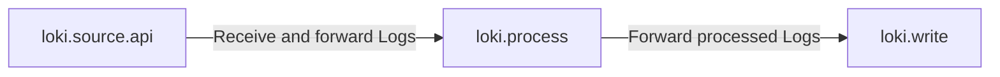
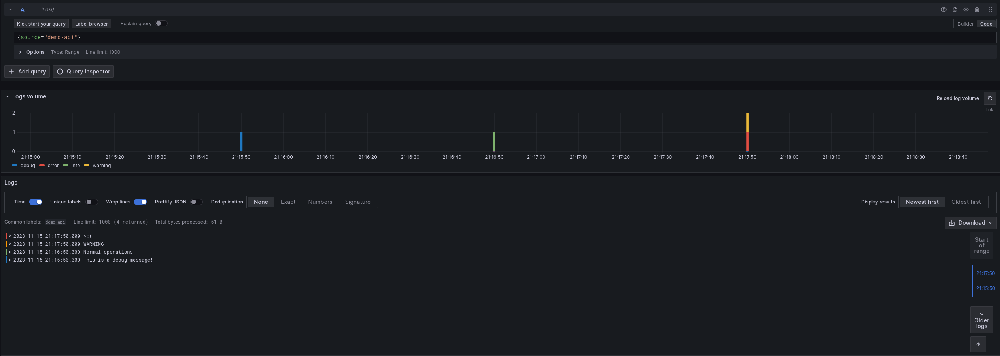

# Receive and process logs

_This section assumes you have familiarity with setting up and connecting Components. It covers using `loki.source.api` to receive logs over HTTP, process and filter them, and then send them to Loki._

## Receive logs over HTTP and Process

### Recommended Reading

- Optional: [loki.source.api](https://grafana.com/docs/agent/latest/flow/reference/components/loki.source.api/)

The `loki.source.api` Component can receive logs over HTTP. It can be useful for receiving logs from other Agents, or for receiving logs from applications that can send logs over HTTP, and processing them centrally.

Our pipeline is going to look like this:



Hopefully by now you have an idea of how this might look (details aside). Let's start by setting up the `loki.source.api` Component:

```river
loki.source.api "listener" {
    http {
        listen_address = "127.0.0.1"
        listen_port    = 9999
    }

    labels = { "source": "api" }

    forward_to = [loki.process.process_logs.receiver]
}
```

This is a pretty simple configuration. We are telling the `loki.source.api` Component to listen on `127.0.0.1:9999`, attaches a `source="api"` label to received logs, and forward them to the `loki.process.process_logs` Component's exported receiver. Let's configure the `loki.process` and `loki.write` components next.

## Process and Write Logs

### Recommended Reading

- [loki.process#stage.drop](https://grafana.com/docs/agent/latest/flow/reference/components/loki.process/#stagedrop-block)
- [loki.process#stage.json](https://grafana.com/docs/agent/latest/flow/reference/components/loki.process/#stagejson-block)
- [loki.process#stage.labels](https://grafana.com/docs/agent/latest/flow/reference/components/loki.process/#stagelabels-block)

```river
// Let's send and process more logs!

loki.source.api "listener" {
    http {
        listen_address = "127.0.0.1"
        listen_port    = 9999
    }

    labels = { "source" = "api" }

    forward_to = [loki.process.process_logs.receiver]
}

loki.process "process_logs" {

    // Stage 1
    stage.json {
        expressions = {
            log = "",
            ts  = "timestamp",
        }
    }

    // Stage 2
    stage.timestamp {
        source = "ts"
        format = "RFC3339"
    }

    // Stage 3
    stage.json {
        source = "log"

        expressions = {
            is_secret = "",
            level     = "",
            log_line  = "message",
        }
    }

    // Stage 4
    stage.drop {
        source = "is_secret"
        value  = "true"
    }

    // Stage 5
    stage.labels {
        values = {
            level = "",
        }
    }

    // Stage 6
    stage.output {
        source = "log_line"
    }

    // This stage adds static values to the labels on the log line
    stage.static_labels {
        values = {
            source = "demo-api",
        }
    }

    forward_to = [loki.write.local_loki.receiver]
}

loki.write "local_loki" {
    endpoint {
        url = "http://localhost:3100/loki/api/v1/push"
    }
}
```

If you were able to complete the previous section's exercises (first of all, congrats!), you might be able to skim through until the next section. If not, or if you were unsure of what was going on, let's break down what is happening in the `loki.process` Component.

Many of the `stage.*` blocks in `loki.process` act on (either reading or writing) a shared map of values extracted from the logs. You can think of this extracted map as a hashmap or table that each stage has access to and it will be referred to as the "extracted map" from here on. The extracted map can be used in subsequent stages to filter logs, add or remove labels, or even modify the log line itself.

_**NOTE**: `stage.*` blocks are executed in the order they appear in the component, top down._

Let's use an example log line to illustrate this, and go stage by stage showing the contents of the extracted map. Here is our example log line:

```json
{
    "log": {
        "is_secret": "true",
        "level": "info",
        "message": "This is a secret message!",
    },
    "timestamp": "2023-11-16T06:01:50Z",
}
```

#### Stage 1

```river
stage.json {
    expressions = {
        log = "",
        ts  = "timestamp",
    }
}
```

This stage parses the log line as JSON and extracts two values from it, `log` and `timestamp`, and puts them into the extracted map with keys `log` and `ts`, respectively. Note that supplying an empty string is shorthand for using the same key as in the input log line (so `log = ""` is the same as `log = "log"`). The _keys_ of the `expressions` object end up as the keys in the extracted map, and the _values_ are used as keys to look up in the parsed log line.

If this were Python, it might conceptually look like this:

```python
extracted_map = {}
log_line      = {"log": {"is_secret": "true", "level": "info", "message": "This is a secret message!"}, "timestamp": "2023-11-16T06:01:50Z"}

extracted_map["log"] = log_line["log"]
extracted_map["ts"]  = log_line["timestamp"]
```

It may be a little confusing at first, but it will make sense with practice.

Extracted map _before_ performing this stage:

```json
{}
```

Extracted map _after_ performing this stage:

```json
{
    "log": {
        "is_secret": "true",
        "level": "info",
        "message": "This is a secret message!",
    },
    "ts": "2023-11-16T06:01:50Z",
}
```

#### Stage 2

```river
stage.timestamp {
    source = "ts"
    format = "RFC3339"
}
```

This stage is acting on the `ts` value in the extracted map which we extracted in the previous stage. The value of `ts` is parsed in the format of `RFC3339` and added as the timestamp to be ingested by Loki. This is useful if we want to use the timestamp present in the log itself, rather than the time the log is ingested. This stage does not modify the extracted map.

#### Stage 3

```river
stage.json {
    source = "log"

    expressions = {
        is_secret = "",
        level     = "",
        log_line  = "message",
    }
}
```

This stage is acting on the `log` value in the extracted map, which is a value that we extracted in the previous stage. This value also happens to be a JSON object, so we can extract values from it as well. This stage extracts three values from the `log` value, `is_secret`, `level`, and `log_line`, and puts them into the extracted map with keys `is_secret`, `level`, and `log_line`.

If it were Python, it might conceptually look like this:

```python
extracted_map = {
    "log": {
        "is_secret": "true",
        "level": "info",
        "message": "This is a secret message!",
    },
    "ts": "2023-11-16T06:01:50Z",
}

source = extracted_map["log"]

extracted_map["is_secret"] = source["is_secret"]
extracted_map["level"]     = source["level"]
extracted_map["log_line"]  = source["message"]
```

Extracted map _before_ performing this stage:

```json
{
    "log": {
        "is_secret": "true",
        "level": "info",
        "message": "This is a secret message!",
    },
    "ts": "2023-11-16T06:01:50Z",
}
```

Extracted map _after_ performing this stage:

```json
{
    "log": {
        "is_secret": "true",
        "level": "info",
        "message": "This is a secret message!",
    },
    "ts": "2023-11-16T06:01:50Z",
    "is_secret": "true",
    "level": "info",
    "log_line": "This is a secret message!",
}
```

#### Stage 4

```river
stage.drop {
    source = "is_secret"
    value  = "true"
}
```

This stage is acting on the `is_secret` value in the extracted map, which is a value that we extracted in the previous stage. This stage drops the log line if the value of `is_secret` is `"true"` and does not modify the extracted map. There are many other ways to filter logs, but this is a simple example. Refer to the [loki.process#stage.drop](https://grafana.com/docs/agent/latest/flow/reference/components/loki.process/#stagedrop-block) documentation for more information if you are curious.

#### Stage 5

```river
stage.labels {
    values = {
        level = "",
    }
}
```

This stage adds a label to the log using the same shorthand as above (so this is equivalent to using `values = { level = "level" }`). This stage adds a label with key `level` and the value of `level` in the extracted map to the log (`"info"` from our example log line). This stage does not modify the extracted map.

#### Stage 6

```river
stage.output {
    source = "log_line"
}
```

This stage uses the `log_line` value in the extracted map to set the actual log line that is forwarded to Loki. Rather than sending the entire JSON blob to Loki, we are only sending `original_log_line["log"]["message"]`, along with some labels that we attached.

This stage does not modify the extracted map.

## Putting it all together

Now that we have all of the pieces, let's run the Agent and send some logs to it! Modify `config.river` with the config from the previous example and start the agent with:

```bash
/path/to/agent run config.river
```

To get the current time in `RFC3339` format, you can use `2023-11-16T06:01:50Z`. Try executing the following, taking a few minutes away from the current time and replacing the `"timestamp"` value:

```bash
curl localhost:9999/loki/api/v1/raw -XPOST -H "Content-Type: application/json" -d '{"log": {"is_secret": "false", "level": "debug", "message": "This is a debug message!"}, "timestamp": <YOUR TIMESTAMP HERE>}'
```

Now that we have sent some logs, let's see how they look in Grafana. Navigate to [localhost:3000/explore](http://localhost:3000/explore) and switch the Datasource to `Loki`. Try querying for `{source="demo-api"}` and see if you can find the logs you sent!

Try playing around with the values of `"level"`, `"message"`, `"timestamp"`, and `"is_secret"` and see how the logs change. You can also try adding more stages to the `loki.process` Component to extract more values from the logs, or add more labels.


